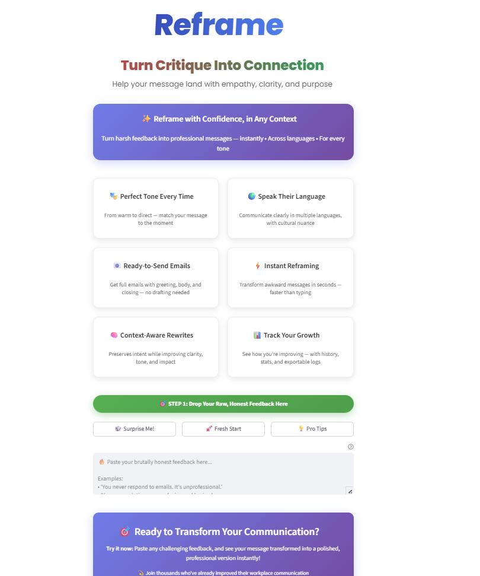

# ✍️ Feedback Rewriter Assistant

An AI-powered tool that rewrites workplace feedback into more professional, clear, and human-friendly tones — choose from **Empathetic**, **Constructive**, or **Managerial** styles.

Built using [Streamlit](https://streamlit.io/) and free open LLMs from [OpenRouter](https://openrouter.ai), powered by Mistral 7B.

## 🚀 Live Demo

🌐 [Try the App](https://feedback-rewriter-gpt-2epkjjin5zogy4mbdwhded.streamlit.app/)

## 🧠 Features

* Rewrites raw or harsh feedback messages into:

  * ✅ Empathetic tone
  * ✅ Constructive tone
  * ✅ Managerial tone
* Built with OpenRouter API (free tier)
* Powered by Mistral-7B-Instruct (fast and smart)
* Simple, responsive UI using Streamlit

## 📆 Tech Stack

* Python
* Streamlit
* OpenRouter API
* Mistral 7B Instruct LLM

## 🛠️ Installation (Run Locally)

```bash
git clone https://github.com/dmmudhan/feedback-rewriter-gpt.git
cd feedback-rewriter-gpt
pip install -r requirements.txt
streamlit run app.py
```

## 🔐 Setup Your API Key

Create a file: `.streamlit/secrets.toml`

```toml
OPENROUTER_API_KEY = "sk-or-your-api-key-here"
```

Get your free key from: [https://openrouter.ai/keys](https://openrouter.ai/keys)

## 📷 Preview



## 🧾 Version History

### ✅ v1.2 (Latest)
- ✨ UI cleaned up with better spacing between sections
- 🧠 Improved system prompt to avoid unwanted email formatting
- 🔄 Built-in fallback logic for models — no user dropdown required
- 🎯 Auto-reset session on first app load after deploy (Streamlit Cloud safe)
- 🚫 Hides technical model failure messages from users
- 💬 Renamed output section: “Here's Your Refined Feedback”
- ✅ Clean, production-ready UX — no manual refresh needed by users

[🔗 Live App](https://feedback-rewriter-gpt-2epkjjin5zogy4mbdwhded.streamlit.app/) · [📂 Source Code](https://github.com/dmmudhan/feedback-rewriter-gpt)

### v1.1 – Tone Detection Update
- Added tone selection input (e.g., formal, friendly, assertive)
- Introduced `prompts.py` for modular prompt design
- Improved user experience with clearer outputs
- Updated Streamlit deployment

[🔗 Live App](https://feedback-rewriter-gpt-caht6hciagxykx52hz6xnh.streamlit.app/)

### v1.0 – Initial Version
- Basic Feedback Rewriting using LLM
- Accepts raw user feedback and rewrites it professionally


## 🤝 Contributing

Pull requests are welcome. Feel free to open an issue or suggest improvements!


## 🧑‍💼 Author

**Devi M**
Prompt Engineering Enthusiast | AI Builder | Freelancing Learner
[LinkedIn](https://www.linkedin.com/in/devimuthyam/)

---

## 📝 License

MIT License
Copyright (c) 2025 Devi M

Permission is hereby granted, free of charge, to any person obtaining a copy
of this software and associated documentation files (the "Software"), to deal
in the Software without restriction, including without limitation the rights
to use, copy, modify, merge, publish, distribute, sublicense, and/or sell
copies of the Software, and to permit persons to whom the Software is
furnished to do so, subject to the following conditions:

The above copyright notice and this permission notice shall be included in
all copies or substantial portions of the Software.

THE SOFTWARE IS PROVIDED "AS IS", WITHOUT WARRANTY OF ANY KIND, EXPRESS OR
IMPLIED, INCLUDING BUT NOT LIMITED TO THE WARRANTIES OF MERCHANTABILITY,
FITNESS FOR A PARTICULAR PURPOSE AND NONINFRINGEMENT. IN NO EVENT SHALL THE
AUTHORS OR COPYRIGHT HOLDERS BE LIABLE FOR ANY CLAIM, DAMAGES OR OTHER
LIABILITY, WHETHER IN AN ACTION OF CONTRACT, TORT OR OTHERWISE, ARISING FROM,
OUT OF OR IN CONNECTION WITH THE SOFTWARE OR THE USE OR OTHER DEALINGS IN
THE SOFTWARE.
